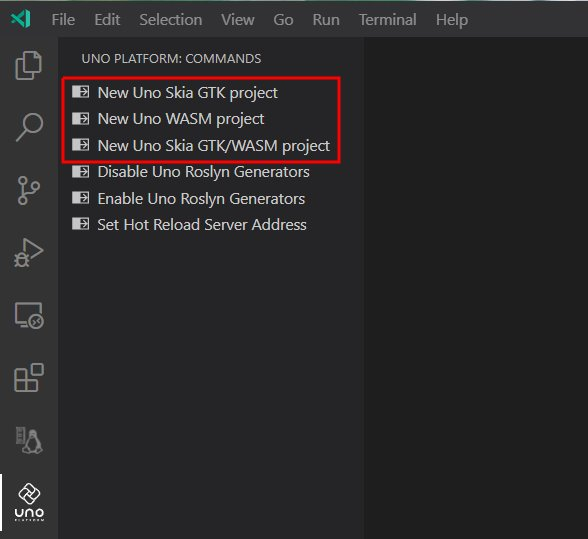
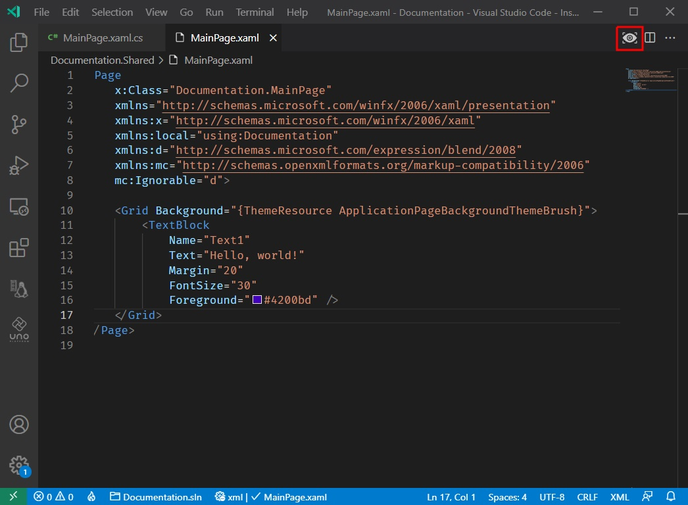

# Setting up your development environment WebAssembly and VS Code

This guide will walk you through the set-up process for building WebAssembly apps with Uno under Windows, Linux, or macOS. You can either create Uno Platform projects directly from the dotnet CLI or by using the Uno Platform VS Code extension.

## Prerequisites
* [**Visual Studio Code**](https://code.visualstudio.com/)

## Create an Uno Platform project (CLI method)

1. Launch Code, then in the terminal type the following to install the Uno Platform templates:
```bash
dotnet new -i Uno.ProjectTemplates.Dotnet::2.2.0
```
1. In the terminal type the following to create a new project:
```bash
dotnet new unoapp -o MyApp -ios=false -android=false -macos=false -uwp=false --vscodeWasm
```

This will create a solution that only contains the WebAssembly platform support.

## Using the VS Code Uno Platform Extension

You can also create Uno Platform projects using the VS Code Uno Platform extension. This extension contains the following features:
   - Skia GTK/WASM Project Templates
   - Automatic `xaml.cs` code-behind file creation upon `.xaml` file creation
   - UWP XAML Autocomplete
   - XAML Previewer
   - XAML Hot Reload

> NOTE: For Skia GTK Template support, the GTK Runtime is required. [Windows/WSL Setup](https://platform.uno/docs/articles/get-started-with-linux.html#setting-for-windows-and-wsl), [Linux Setup](https://platform.uno/docs/articles/get-started-with-linux.html#setting-up-for-linux)

### Installation
1. In Visual Studio Code install the [Uno Platform extension](https://marketplace.visualstudio.com/items?itemName=ms-dotnettools.csharp)

### Features
#### Skia GTK/WASM Project Templates

1. Click on the Uno Platform logo in the activity bar
2. Select the type of project you would like to build (Skia GTK, WASM, or both)
3. Provide the solution name and select a folder for the project
4. Wait for the initial build to finish in order to allow for XAML Autocomplete



#### Automatic code-behind file creation

Adding a new `.xaml` file will automatically create the respective `.xaml.cs` code-behind file next to the `.xaml` file.

#### UWP XAML Autocomplete

With a `.xaml` file open, you can edit the file or use the `CTRL+Space` shortcut to get code completion for the following language features:

1. Controls
2. Properties within Controls
3. Events within Controls
4. Properties with Enum values

> NOTE: This extension is in early development and currently only supports the UWP XAML API, not WinUI.

#### XAML Preview

With a `.xaml` file open and selected, the `Preview Uno Platform XAML` button will be displayed. Clicking on the button will open the `XAML Preview` panel that will display a render of the current XAML view.



#### XAML Hot Reload

Start the debug process by pressing `F5` and edit the currently displayed `.xaml` file to see hot reload in action

## Prepare the WebAssembly application for debugging

1. Install the [C# extension](https://marketplace.visualstudio.com/items?itemName=ms-dotnettools.csharp) and the [JavaScript Debugger (Nightly)](https://marketplace.visualstudio.com/items?itemName=ms-vscode.js-debug-nightly) extension with the debug.javascript.usePreview setting set to true (**File** / **Preference** / **Settings**, search for `Use preview`).
1. Open Code using
    ```bash
    code ./MyApp
    ```
1. Visual Studio will ask to restore the nuget packages

## Modify the template
1. In MainPage.xaml, replace the Grid's content with the following:
    ```xaml
    <StackPanel> 
        <TextBlock x:Name="txt" 
                    Text="Hello, world!" 
                    Margin="20" 
                    FontSize="30" /> 
        <Button Content="click" 
                Click="OnClick" /> 
    </StackPanel>
    ```
1. In your MainPage.xaml.cs, add the following method:
    ```csharp
    public void OnClick(object sender, object args) 
    { 
        var dt = DateTime.Now.ToString(); 
        txt.Text = dt; 
    }
    ```

## Run and Debug the application

1. Starting the app with the WebAssembly debugger is a two-step process:
    1. Start the app first using the **“.NET Core Launch (Uno Platform App)”** launch configuration
    1. Then start the browser using the **“.NET Core Debug Uno Platform WebAssembly in Chrome”** launch configuration (requires Chrome). To use the latest stable release of Edge instead of Chrome, change the type of the launch configuration in `.vscode/launch.json` from `pwa-chrome` to `pwa-msedge`
1. Place a breakpoint in the OnClick method
1. Click the button in the app, and the breakpoint will hit

## Updating an existing application to work with VS Code

If you already have an Uno application, you can add some some missing support files the VS Code to recognize your project.

Here's how to do this:
1. Use the same command line above to create a project with the same name as your current project, in a different location.
1. Once created, copy the generated `.vscode` folder next to your `.sln` file
1. Update the `Uno.UI` package version to 2.2.0-dev.489 or later version
1. Update the `Uno.Wasm.Bootstrap` package to 1.2.0-dev.24 or later version
1. Add the `<PackageReference Include="Uno.Wasm.Bootstrap.DevServer" Version="1.2.0-dev.24" PrivateAssets="all" />` item in the same item group as the other nuget packages.
1. In your Wasm project file, if you had a `<DotNetCliToolReference />` line, remove it

You should now be in the same configuration as the generated template files.
